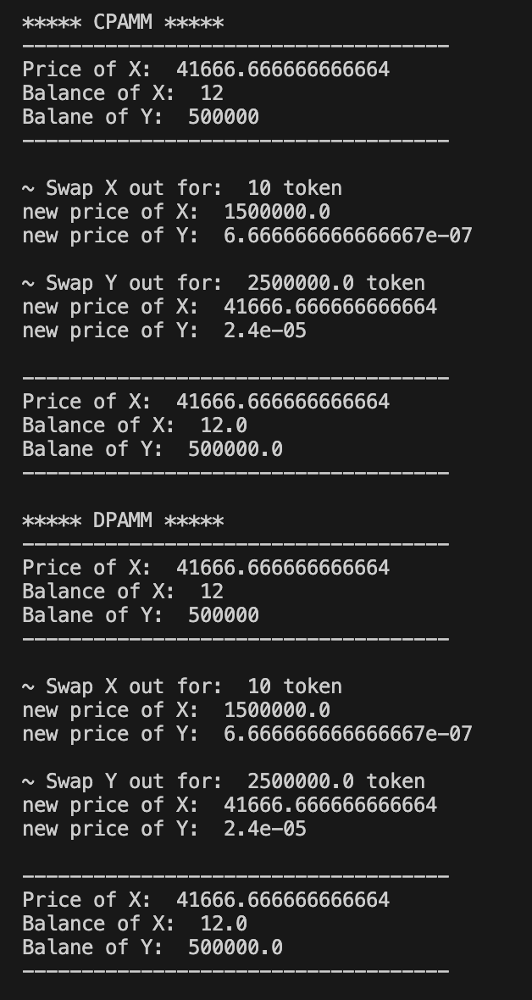

# Basic-Swap-DPAMM-CPAMM

This repo is a minimal proof of the concept that DPAMM can replicate the characteristic of CPAMM when both supply is set proportionally correspondingly to the price.

## What we did

1. Create a pair of token X and Y
2. Set the supply of `X to 12, and Y to 500000`
3. Set the price of each token based on CPAMM pricing, which is `price of X = Y/X = 41666.666666666664 and price of Y = X/Y = 0.000024`
4. Try swap X for Y.
5. Use entire Y acquired from the previous swap to swap back for X.
   > Note: There is no trading fees charged here, so `k` remains stable
6. Do everything above to DPAMM
7. Compare if both CPAMM and DPAMM provide the same result.
   > Note: that there could be overflow/underflow occur, especially in DPAMM which requires extra computation. The compromise we accept for the error threshold is `0.1%`.

## Result Summary

Both CPAMM and DPAMM yield the exact same result. This proves that DPAMM can replicate CPAMM's curve behaviour if the setting matches.

## Guide

Clone this repository
`git clone https://github.com/Ax11-Labs/Basic-Swap-DPAMM-CPAMM.git`

Go to the downloaded repo, make sure you have [Python3](https://www.python.org/downloads/) on your computer, and run:
`python3 ./test/tCPAMM.py && python3 ./test/tDPAMM.py`

Adjust the value within the `./test/tCPAMM.py` and `./test/tDPAMM.py` as you like for more experiments.

## Contribution

This repository is made open-source with the MIT license. In short, just do whatever you want.
